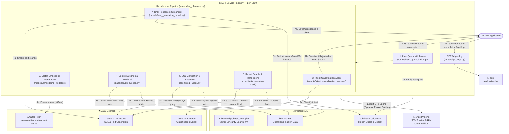

# MaintWiz Async Conversational AI Web Service

An asynchronous FastAPI service that leverages AWS Bedrock for Conversational AI, Text-to-SQL query generation, PostgreSQL vector similarity database retrieval, dynamic multi-tenant token quota enforcement, and LLM observability with Arize Phoenix tracing.

---

## Application Structure

The application codebase is organized as follows:

- [main.py](main.py): Entry point for the FastAPI application. Sets up lifespan event handlers to initialize routes, manage connection pools, and flush OpenTelemetry traces.
- [Dockerfile](Dockerfile): Configuration for building the containerized deployment image.
- [docker-compose.yml](docker-compose.yml): Minimal Docker Compose setup for local orchestration.
- [dockerbuild.sh](dockerbuild.sh): Script to automate Docker image creation and deployment.
- [Makefile](Makefile): Convenience commands for building, running, and managing the application environment.
- [pyproject.toml](pyproject.toml) & [requirements.txt](requirements.txt): Python dependency manifests and metadata.
- [uv.lock](uv.lock): Dependency lockfile managed via the `uv` package installer.

### Subdirectories and Core Components

- **`config/`** - Application settings, environment setup, and logger definitions.
  - [config/settings.py](config/settings.py): Centralized configuration management; defines AWS Bedrock model IDs, DB connection credentials, and Arize Phoenix tracing endpoints.
  - [config/logger_config.py](config/logger_config.py): Standardized application logging utility.
- **`routers/`** - API controllers defining request/response endpoints and pipeline filters.
  - [routers/llm_inference.py](routers/llm_inference.py): Primary router endpoint `/AI/chat-completion` orchestrating the entire inference, RAG, SQL generation, result execution, and streaming pipeline.
  - [routers/user_quota_limiter.py](routers/user_quota_limiter.py): Quota check middleware verifying user registration and checking remaining token balance in PostgreSQL.
  - [routers/get_logs.py](routers/get_logs.py): Log retrieval router providing access to server log outputs.
  - [routers/deprecated/rate_limiters.py](routers/deprecated/rate_limiters.py): (Deprecated) Legacy rate-limiting implementation.
- **`agents/`** - Specialized domain agents for prompt orchestration.
  - [agents/intent_classification_agent.py](agents/intent_classification_agent.py): Classifies user inputs into SQL query generation, simple greetings, follow-up pagination, or out-of-bounds rejections.
  - [agents/sql_agent.py](agents/sql_agent.py): Calls AWS Bedrock to generate database-specific PostgreSQL queries, sanitizes them, and executes them against active database pools.
- **`models/`** - Models, clients, and validation schemas.
  - [models/bedrock_client.py](models/bedrock_client.py): Wrapper client facilitating streaming and non-streaming requests to AWS Bedrock runtime.
  - [models/embedding_model.py](models/embedding_model.py): Generates dense vector representations (1024-d) using Amazon Titan Embeddings.
  - [models/classification_model.py](models/classification_model.py): Handles prompt execution for intent classification models.
  - [models/text_generation_model.py](models/text_generation_model.py): Stream/Response generator utilizing Bedrock LLMs (Llama 3 70B / 8B).
  - [models/data_models.py](models/data_models.py): Pydantic input models (e.g. `ChatCompletionRequest`).
- **`database/`** - Asynchronous database connectivity, pooling, and SQL queries.
  - [database/pool_manager.py](database/pool_manager.py): Connection pool manager (`get_pool`, `close_all_pools`) creating per-tenant `asyncpg` database pools.
  - [database/db_connection.py](database/db_connection.py): Dynamic connection creation (`connect_to_db`, `validate_database`, `check_db_connection`).
  - [database/db_queries.py](database/db_queries.py): Vector cosine similarity search (`<=>`), user details fetching, SQL sanitization/execution, and user quota balance updates.
- **`dataprocessing/`** - Preprocessing and conversational state handling.
  - [dataprocessing/user_query_processing.py](dataprocessing/user_query_processing.py): Merges current user queries with historical conversation context to resolve coreferences.
  - [dataprocessing/kbe_table_embedding_generation.py](dataprocessing/kbe_table_embedding_generation.py): Pre-computes vector embeddings for schema tables and few-shot example contexts.
- **`responses/`** - Custom Starlette / FastAPI response handlers.
  - [responses/streaming_response.py](responses/streaming_response.py): Customized Starlette `StreamingResponse` that tracks total token usage across all pipeline spans and deducts spent tokens from the user's database balance upon stream completion.
- **`prompts/`** - Dynamic prompt templates and instructions.
  - [prompts/prompts_templates.py](prompts/prompts_templates.py): System instructions and few-shot formatting for intent classification, SQL generation, large-volume result refinement, and final natural language synthesis.
- **`systemctl/`** - Production service unit templates.
  - [systemctl/bedrock_conv_ai.service](systemctl/bedrock_conv_ai.service): Systemd service unit template for Ubuntu server deployment.
- **`tests/`** - Load and concurrency testing tools.
  - [tests/locustfile.py](tests/locustfile.py): Locust script for HTTP load testing.
  - [tests/test_bedrock_pool_concurrency.py](tests/test_bedrock_pool_concurrency.py): Concurrency testing utility for database pool performance.

---

## System Architecture

The following diagram illustrates the request flow and service components across FastAPI, AWS Bedrock, PostgreSQL, and Arize Phoenix:



### Key Components Matrix

| Component                     | Responsibility                                                                                                         |
| :---------------------------- | :--------------------------------------------------------------------------------------------------------------------- |
| **FastAPI**                   | Asynchronous HTTP Web Server handling lifespan events, routing, and connection pool management.                        |
| **User Quota Middleware**     | Validates client user ID against PostgreSQL; enforces token usage bounds (`uaq_quota_limit` vs `uaq_used_count`).      |
| **Intent Classifier Agent**   | Routes incoming queries into `sql`, `greeting`, `rejected`, or `follow_up_pagination` using Llama 3 8B.                |
| **Embedding & Vector RAG**    | Converts query into 1024-d Titan embeddings and performs PGVector cosine distance (`<=>`) schema context search.       |
| **SQL Agent**                 | Formats prompt with schema + user context, calls Llama 3 70B to generate SQL, injects facility code, & executes query. |
| **Result Guards**             | Detects over-limit result sets (>500 items) to trigger AI refinement, and checks row truncation (>50 items).           |
| **Custom Streaming Response** | Streams natural language answers chunk-by-chunk to the client and updates token consumption upon stream finish.        |
| **Arize Phoenix Tracing**     | Captures OpenTelemetry spans for every step; routes traces dynamically to per-tenant projects in Arize Phoenix.        |

---

## Detailed End-to-End Application Flow

When a client submits a request to `POST /convai/AI/chat-completion`, the application executes the following sequential steps:

### 1. Lifespan & Connection Pool Setup

- Upon FastAPI startup (`main.py`), connection pools are managed lazily per client database schema via `database/pool_manager.py`.
- On application shutdown, all `asyncpg` connection pools are closed gracefully, and pending OpenTelemetry spans are force-flushed to Arize Phoenix.

### 2. Request Entry & Dynamic Telemetry Scope

- **Endpoint**: `POST /AI/chat-completion` in [routers/llm_inference.py](routers/llm_inference.py).
- Dependency injection `_dep` executes before the route handler.
- **Dynamic Project Routing**: Sets `current_db_var` ContextVar to the target `database_name`. The `DynamicProjectProcessor` mutates span attributes on finish to route traces directly into tenant-specific Arize Phoenix projects.
- Starts the root `chat_chain` server span with user ID and database context attributes.

### 3. Rate Limiting & User Quota Verification

- Invokes `user_quota_limiter` in [routers/user_quota_limiter.py](routers/user_quota_limiter.py).
- Queries `public.user_ai_quota` to verify:
  1. The user exists (`CHECK_IF_USER_QUOTA_LIMIT_EXISTS`). Returns `403 Forbidden` if unassigned.
  2. Remaining quota balance (`CHECK_IF_USER_QUOTA_LEFT`). Returns `429 Too Many Requests` if quota is exhausted.
- Attaches quota metadata (limit, current usage) to the active OpenTelemetry span.

### 4. User Query & Conversation Coreference Processing

- Calls `get_last_and_current_user_query` in `dataprocessing/user_query_processing.py`.
- Merges historical conversation turns (`chat_history`) with the current user query to resolve pronouns and coreferences (e.g. "What about facility B?").

### 5. LLM Intent Classification Agent

- Starts span `1. intent_classification`.
- Sends user query and past queries to AWS Bedrock (Llama 3 8B Instruct) via `agents/intent_classification_agent.py`.
- Parses structured JSON response into one of four actions:
  - **`return_greeting`**: Returns immediate greeting text, updates token usage in DB, and ends request.
  - **`return_rejection_response`**: Returns out-of-scope rejection message, updates token usage, and ends request.
  - **`follow_up_pagination`**: Bypasses vector context retrieval (uses previous query schema).
  - **`call_sql_model`**: Proceeds to vector embedding generation and Text-to-SQL synthesis.

### 6. Dense Vector Embedding & Context Retrieval

- Starts span `2. embedding_generation`. Generates 1024-dimensional dense vector embeddings using Amazon Titan (`models/embedding_model.py`).
- Starts span `2b. context_retrieval`. Calls `fetch_context` in `database/db_queries.py`:
  - Executes PGVector cosine distance query (`embedding <=> user_query_vector`) on `ai.knowledge_base_examples`.
  - Retrieves relevant table schemas and top few-shot SQL examples.
  - Fetches dynamic user credentials and facility codes (`fetch_user_details`).

### 7. SQL Generation, Sanitization & Database Execution

- Starts span `3. sql_generation`.
- Formats `sql_generation_prompt` incorporating table schema, user details, facility code (`facm_code`), few-shot examples, and chat history.
- Invokes AWS Bedrock Llama 3 70B Instruct via `agents/sql_agent.py`.
- **Sanitization & Interpolation**: Passes raw SQL to `format_sql_query`, substituting `<facilitycode>` placeholders with actual client codes and cleaning code fence blocks.
- Executes SQL query asynchronously against the client's `asyncpg` database pool.

### 8. Result Size Safety Guards & Truncation Handling

- **Large Volume Refinement (>500 data points)**:
  - If `num_rows * num_cols > 500`, triggers span `3b. large_volume_refine`.
  - Calls Bedrock LLM with `format_large_volume_refine_prompt` to provide intelligent query narrowing recommendations.
  - Updates spent tokens in database quota and returns early to prevent context window overflow.
- **Truncation Detection (50 row limit)**:
  - If `num_rows == 50` and `LIMIT` is present in generated SQL, triggers span `3c. truncation_check`.
  - Runs a background fallback `SELECT COUNT(*) FROM (...)` query. If total count exceeds 50, appends a system note guiding the assistant to inform the user that results are truncated.

### 9. Final Response Generation & Real-Time Streaming

- Formats `response_to_user_prompt` using retrieved SQL table rows, table schema, and user question.
- Launches background thread producer with `generate_stream_response` (Llama 3 70B Instruct).
- Wraps output in custom `StreamingResponse` ([responses/streaming_response.py](responses/streaming_response.py)).
- Streams natural language response chunks to client in real-time.

### 10. Post-Stream Token Accounting & Database Quota Subtraction

- As stream chunks are sent, accumulates total prompt and completion token counts from all pipeline spans (`span1`, `span2`, `span2b`, `span3`, `span4`).
- Upon stream completion (or failure), asynchronously executes `UPDATE_USER_QUOTA_USAGE` in PostgreSQL:
  ```sql
  UPDATE public.user_ai_quota
  SET uaq_used_count = uaq_used_count + $2
  WHERE uaq_user_id = $1;
  ```

### 11. LLM Observability & Arize Phoenix Tracing

- All execution spans (`chat_chain`, `Rate Limiter`, `1. intent_classification`, `2. embedding_generation`, `2b. context_retrieval`, `3. sql_generation`, `4. final_response`) are dynamically routed and exported to Arize Phoenix endpoints for real-time latency monitoring, token accounting, and groundedness evals.

---

## Current Status & Completed Features

- [x] **Asynchronous Web Service Architecture**: FastAPI service with `asyncpg` connection pool lifecycle management.
- [x] **Multi-Tenant Database Pool Management**: On-demand pooling for multiple PostgreSQL database schemas with connection validation.
- [x] **Dynamic Per-Tenant Trace Isolation**: `DynamicProjectProcessor` dynamically routes OpenTelemetry spans to tenant-specific projects in Arize Phoenix.
- [x] **Vector RAG Integration**: Amazon Titan 1024-d text embeddings combined with PostgreSQL PGVector (`<=>`) similarity search over schema definitions and few-shot examples.
- [x] **Intelligent Intent Classifier Agent**: Llama 3 8B agent routing queries to SQL, direct greetings, out-of-scope rejections, or pagination handler.
- [x] **Robust Text-to-SQL Pipeline**: Prompt engineering with schema injection, facility code (`facm_code`) dynamic interpolation, clean string extraction, and query execution.
- [x] **Result Size Safety Guards**:
  - Over-limit result refinement (>500 items) to prevent response payload overflow.
  - Automatic `COUNT(*)` subquery check to detect and notify when 50-row display limits truncate matching data.
- [x] **Token Quota Middleware & Deductive Streaming**: Custom Starlette `StreamingResponse` verifying user token limits pre-execution and updating token usage in PostgreSQL post-response.
- [x] **Evaluation Mode Support**: `eval_mode=True` parameter returning complete structured JSON payloads (SQL, schema, retrieved rows, response) for automated benchmarks.
- [x] **Observability & Diagnostics**: OpenTelemetry instrumentation with Arize Phoenix integration and server log retrieval endpoint (`GET /AI/get-log`).
- [x] **Performance Testing**: Concurrency test suite and Locust load testing script (`tests/locustfile.py`).

---

## Pending & Remaining Tasks

- [ ] **Automated Unit & Integration Test Suite**: Expand testing beyond Locust load scripts to include automated Pytest suites covering edge-case queries, database connection drops, and mock AWS Bedrock responses.
- [ ] **Deprecation Cleanup**: Remove legacy unused rate-limiter implementations in [routers/deprecated/rate_limiters.py](routers/deprecated/rate_limiters.py).
- [ ] **Pre-Execution SQL Validation (`EXPLAIN` Dry-Run)**: Execute an `EXPLAIN` query before running LLM-generated SQL to catch syntax errors or non-performant execution plans before hitting operational tables.
- [ ] **Database Schema In-Memory Caching**: Implement an in-memory cache (e.g. redis or LRU cache) for vector schema contexts to eliminate repetitive database lookups for common user intents.
- [ ] **Server-Side Conversation State Management**: Transition multi-turn chat history from client-passed arrays to server-side session persistence in PostgreSQL or Redis.
- [ ] **Input & Output Guardrails Layer**: Integrate strict PII scrubbing and prompt injection defense filters on raw user inputs and generated responses.

---

## Future Enhancements & Recommendations

1. **AWS Bedrock Prompt Caching**:
   - Utilize AWS Bedrock prompt caching for static system instructions and table schema templates to significantly reduce inference latency and token costs.
2. **Multi-Model Redundancy & Automated Failovers**:
   - Implement failover mechanisms to switch seamlessly between model variants (e.g., Llama 3 70B → Anthropic Claude 3.5 Sonnet / Mixtral) in case of Bedrock API rate limits or regional service degradation.
3. **Semantic Query Caching**:
   - Implement a semantic cache (e.g., GPTCache / Redis Vector) to serve instant responses for identical or highly similar vector queries without calling LLM endpoints.
4. **WebSocket & Server-Sent Events (SSE) Interface**:
   - Provide WebSocket or SSE streaming endpoints for bi-directional real-time communication in chat UI interfaces.
5. **Dynamic Knowledge Base Management Portal**:
   - Build an administrative API to dynamically upload, update, and re-index database table schemas and few-shot examples into the PGVector store without requiring manual script execution.
6. **AST-Based SQL Security Validation**:
   - Incorporate an AST SQL parser (such as `sqlglot`) to enforce strict read-only query policies, blocking any destructive keywords (`DROP`, `UPDATE`, `DELETE`, `ALTER`, `TRUNCATE`).

---

## Project Commands

### Database Prerequisites

Install the vector extension in the PostgreSQL schema where vector similarity searches will be performed:

```sql
CREATE EXTENSION IF NOT EXISTS vector SCHEMA ai;
```

---

### LLM Observability Setup (Arize Phoenix)

#### Dependencies Installation

```bash
uv pip install arize-phoenix-otel openinference-instrumentation-openai opentelemetry-instrumentation-fastapi openinference-semantic-conventions
```

#### Docker Run Command (With Auto-Restart & Authentication)

```bash
docker run -d \
  --name arize_phoenix \
  --restart unless-stopped \
  -e PHOENIX_ENABLE_AUTH=True \
  -e PHOENIX_SECRET=c14ed237a7d37cf298372efc31fdff53b65e9f98a43d9faefab731a53a74daea \
  -p 6006:6006 \
  -p 4317:4317 \
  -p 9090:9090 \
  -e PHOENIX_WORKING_DIR=/mnt/data \
  -v phoenix_data:/mnt/data \
  arizephoenix/phoenix:version-11.23.1
```

#### Docker Run Command (Without Authentication)

```bash
docker run -d \
  --name arize_phoenix \
  --restart unless-stopped \
  -p 6006:6006 \
  -p 4317:4317 \
  -p 9090:9090 \
  -e PHOENIX_WORKING_DIR=/mnt/data \
  -v phoenix_data:/mnt/data \
  arizephoenix/phoenix:latest
```

---

### Application Execution Commands

#### 1. Command to Run Pre-computation Embedding Generation

```bash
cd /home/ec2-user/ai/conv_ai
source venv/bin/activate
python3 -m dataprocessing.kbe_table_embedding_generation
```

#### 2. Local Execution via Uvicorn

```bash
python3 -m uvicorn main:app --host 0.0.0.0 --port 8000 --reload
```

#### 3. Production Server Execution (Background Detached Mode)

```bash
cd /home/ec2-user/ai/conv_ai/
/home/ec2-user/ai/conv_ai/venv/bin/python3 -m pip install -r requirements.txt

nohup /home/ec2-user/ai/conv_ai/venv/bin/python3 -m uvicorn main:app --host 0.0.0.0 --port 8000 > out.log 2>&1 &
```

---

### Systemd Service Configuration (Ubuntu / RHEL)

#### Create Systemd Unit File

```bash
sudo nano /etc/systemd/system/bedrock_conv_ai.service
```

#### Unit File Contents

```ini
[Unit]
Description=SQL Conv AI Bedrock WebService
After=network.target

[Service]
Type=simple
User=ec2-user
WorkingDirectory=/home/ec2-user/ai/async_conv_ai
ExecStart=/home/ec2-user/ai/async_conv_ai/.venv/bin/python3 -m uvicorn main:app \
  --host 0.0.0.0 \
  --port 8000
Restart=yes
RestartSec=5
Environment=PATH=/home/ec2-user/ai/async_conv_ai/.venv/bin:/usr/bin:/bin

[Install]
WantedBy=multi-user.target
```

#### Enable and Start Service

```bash
sudo systemctl daemon-reload
sudo systemctl enable bedrock_conv_ai
sudo systemctl start bedrock_conv_ai
sudo systemctl status bedrock_conv_ai
```

---

### Arize Phoenix Tracing Filter Examples

Filter traces by client user ID in the Phoenix Web UI:

```text
metadata.payload.user_id == 1091
```
