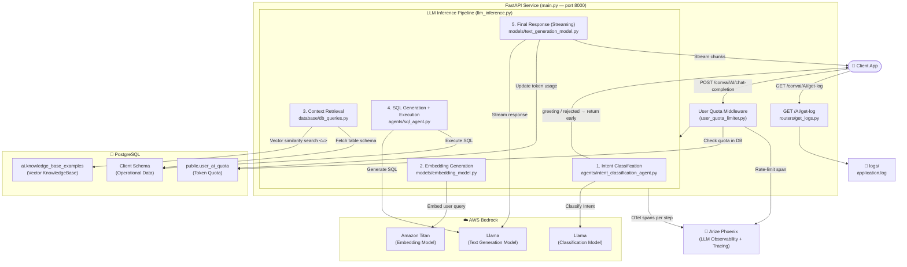

# MaintWiz Async Conversational AI Web Service

An asynchronous FastAPI service that uses AWS Bedrock to build a Conversational AI bot, including intent classification, SQL query generation, database retrieval, token quota control, and LLM observability with Arize Phoenix tracing.

## Application Structure

The application codebase is organized as follows:

- [main.py](main.py): Entry point for the FastAPI application. Sets up lifespan event handlers to initialize routes and flush OTel tracer outputs.
- [Dockerfile](Dockerfile): Configuration for building the container image.
- [docker-compose.yml](docker-compose.yml): Minimal Docker Compose setup for local orchestration.
- [pyproject.toml](pyproject.toml) & [requirements.txt](requirements.txt): Configuration and dependencies of the Python project.
- [tokenizer.json](tokenizer.json): Pre-trained HuggingFace tokenization vocabulary configuration.
- [uv.lock](uv.lock): Lockfile management for dependencies using the `uv` package installer.

### Subdirectories and Core Components

- **`config/`** - Application settings, environment setup, and logger definitions.
  - [config/settings.py](config/settings.py): Loads configuration settings from the environment, defines AWS Bedrock model IDs, DB connection pools, and Arize Phoenix tracing endpoints.
  - [config/logger_config.py](config/logger_config.py): Common logger settings utility.
- **`routers/`** - API route controllers defining endpoint request/response contracts and pipeline filters.
  - [routers/llm_inference.py](routers/llm_inference.py): Post-request route `/AI/chat-completion` handling token checks, routing user inputs through intent classification, generating/running SQL, and returning a streaming response.
  - [routers/user_quota_limiter.py](routers/user_quota_limiter.py): Quota check middleware verifying that the user is registered and has sufficient token usage balance remaining in the database.
  - [routers/deprecated/rate_limiters.py](routers/deprecated/rate_limiters.py): (Deprecated) Rate limiting middleware matching the logic of the user quota checks.
  - [routers/get_logs.py](routers/get_logs.py): Helper API router to read and retrieve application logs.
- **`agents/`** - Domain agents implementing LLM instructions.
  - [agents/intent_classification_agent.py](agents/intent_classification_agent.py): Determines whether user queries map to SQL databases, simple greetings, or fall out of bounds (rejections).
  - [agents/sql_agent.py](agents/sql_agent.py): Orchestrates SQL generation by calling LLM models, matching it against active database pools, and retrieving results.
- **`models/`** - Wrappers, clients, and schemas mapping to external LLMs and databases.
  - [models/bedrock_client.py](models/bedrock_client.py): Class implementation facilitating streaming and non-streaming responses through AWS Bedrock.
  - [models/embedding_model.py](models/embedding_model.py): Generates dense vector representations for queries using Amazon Titan Embeddings.
  - [models/classification_model.py](models/classification_model.py): Orchestrates prompt execution on the Bedrock classification models.
  - [models/text_generation_model.py](models/text_generation_model.py): Stream/Response generator utilizing Bedrock LLMs.
  - [models/data_models.py](models/data_models.py): Pydantic validation schemas (e.g. `ChatCompletionRequest`).
- **`database/`** - DB connectivity and low-level SQL helpers.
  - [database/db_connection.py](database/db_connection.py): Handlers for Postgres async pool creation (`connect_to_db`, `validate_database`).
  - [database/db_queries.py](database/db_queries.py): Executes context searching (vector distance queries `<=>`), updates user quota consumption, and pulls user info.
- **`dataprocessing/`** - Content preprocessing and historical memory utilities.
  - [dataprocessing/user_query_processing.py](dataprocessing/user_query_processing.py): Merges previous messages with current queries to resolve coreferences in conversational context.
  - [dataprocessing/kbe_table_embedding_generation.py](dataprocessing/kbe_table_embedding_generation.py): Local utility to pre-compute vector embeddings for example context templates.
- **`responses/`** - Custom Starlette and FastAPI response templates.
  - [responses/streaming_response.py](responses/streaming_response.py): Inherits and extends Starlette `StreamingResponse` to track total token usage metrics and dynamically subtract from user database balances upon successfully completing a stream response.
- **`prompts/`** - Stores conversational prompts and instructions.
  - [prompts/prompts_templates.py](prompts/prompts_templates.py): Centralized few-shot context builders mapping dynamic user info to Llama/Titan templates.
- **`systemctl/`** - Service execution templates.
  - [systemctl/bedrock_conv_ai.service](systemctl/bedrock_conv_ai.service): Template to install the app as a systemd service under Ubuntu.
- **`tests/`** - Contains testing code for performance metrics.
  - [tests/locustfile.py](tests/locustfile.py): Load testing script using Locust.

---

## System Architecture

Here is the high-level architecture diagram showing the request flow and components of the application:

### Key Components

| Component                      | Responsibility                                                                                                |
| :----------------------------- | :------------------------------------------------------------------------------------------------------------ |
| **FastAPI**                    | Async HTTP server, request routing, and lifecycle management.                                                 |
| **Quota Middleware**           | Validates the user, checks token balance before executing queries, and enforces rate limits.                  |
| **Intent Classifier**          | Routes requests: identifies if a query is a database query (SQL pipeline), a simple greeting, or invalid.     |
| **Embedding & Knowledge Base** | Converts user query to dense vector embeddings and retrieves relevant database schemas and few-shot examples. |
| **SQL Agent**                  | Generates database-specific PostgreSQL queries via LLM and executes them against the pool.                    |
| **Streaming Response**         | Streams the final natural language answer back to the client, updating database token usage upon success.     |
| **Arize Phoenix**              | Receives OTel traces to visualize latency, tokens, spans, and LLM prompt execution.                           |

---

## Project Commands

Install vector extension in the schema where vector similarity search will be done

Ex: schema - ai

# ---- LLM Observability Tool ------------------------------------------------------------------------------------------------------

## Dependencies

uv pip install arize-phoenix-otel openinference-instrumentation-openai opentelemetry-instrumentation-fastapi openinference-semantic-conventions

## Docker Run Command with auto-restart and auth

docker run -d \
 --name arize_phoenix \
 --restart unless-stopped \
 -e PHOENIX_ENABLE_AUTH=True \
 -e PHOENIX_SECRET=c14ed237a7d37cf298372efc31fdff53b65e9f98a43d9faefab731a53a74daea \
 -p 6006:6006 \
 -p 4317:4317 \
 -p 9090:9090 \
 -e PHOENIX_WORKING_DIR=/mnt/data \
 -v phoenix_data:/mnt/data \
 arizephoenix/phoenix:version-11.23.1

## Docker Run Command without auto-restart

docker run \
 -p 6006:6006 \
 -p 4317:4317 \
 -p 9090:9090 \
 -d \
 --restart unless-stopped \
 -e PHOENIX_WORKING_DIR=/mnt/data \
 -v phoenix_data:/mnt/data \
 -arizephoenix/phoenix:latest

## --------------------------------------- Command To run Uvicorn in maintwiz.ai server --------------------------------------------

cd ../home/ubuntu

source venv/bin/activate

cd ai-chat-completion

python3 -m uvicorn main:app --host 0.0.0.0 --port 5001

## ----------------------------------------- COMMAND TO GENERATE EMBEDDING ---------------------------------------------------------

# WKDIR

cd ../home/ec2-user/ai/conv_ai

# VENV

source venv/bin/activate

# Script Run

python3 -m database.kbe_table_embedding_generation

## ----------------------------------------- COMMAND TO RUN FASTAPI ----------------------------------------------------------------

## 1.Command to run a single file in local vscode

# WKDIR: presanth@Presanths-Laptop ai_chat_bot_v1_faccode %

python3 -m dataprocessing.kbe_table_embedding_generation

# 2.Command to install pip dependencies in prelive server

cd /home/ec2-user/ai/conv_ai/
/home/ec2-user/ai/conv_ai/venv/bin/python3 -m pip install -r requirements.txt

# 3.To RUN detached and store output in out.log

nohup /home/ec2-user/ai/conv_ai/venv/bin/python3 -m uvicorn main:app --host 0.0.0.0 --port 8000 > out.log 2>&1 &

## ------------------------------------------ SERVER SYSTEMCTL ----------------------------------------------------------------------

# CMD 1:

sudo nano /etc/systemd/system/conv_ai.service
sudo nano /etc/systemd/system/bedrock_conv_ai.service

# File Contents:

[Unit]
Description=SQL Conv AI Bedrock WebService
After=network.target

[Service]
Type=simple
User=ec2-user
WorkingDirectory=/home/ec2-user/ai/async_conv_ai
ExecStart=/home/ec2-user/ai/async_conv_ai/.venv/bin/python3 -m uvicorn main:app \
 --host 0.0.0.0 \
 --port 8000
Restart=yes
RestartSec=5
Environment=PATH=/home/ec2-user/ai/async_conv_ai/.venv/bin:/usr/bin:/bin

[Install]
WantedBy=multi-user.target

# Pheonix Tracing CMND

### filtercmnd

metadata.payload.user_id == 1091
